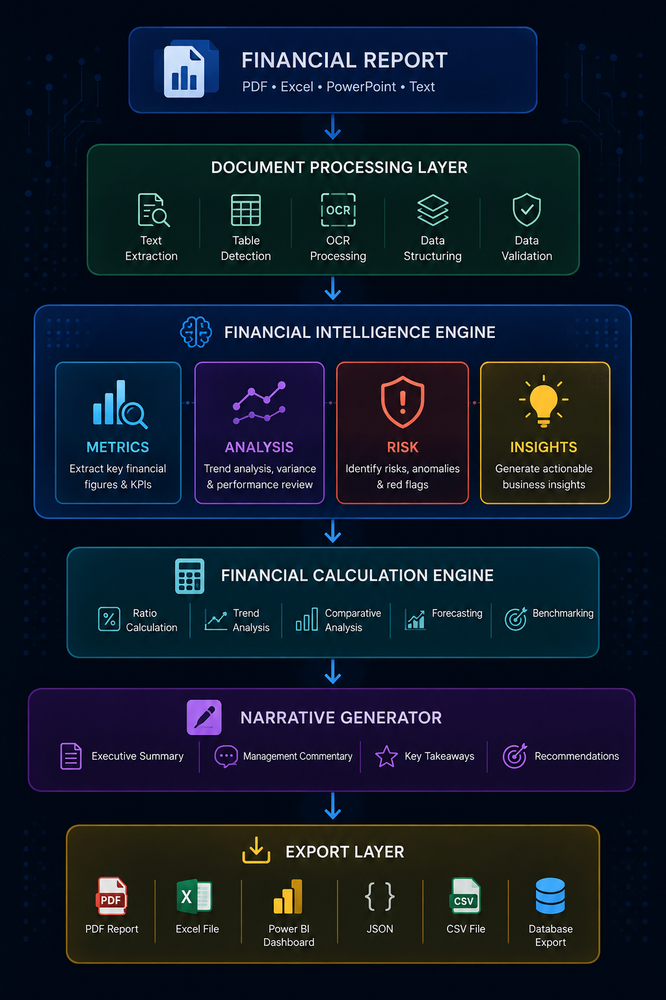

# 📊 CoreInsight Financial Report Intelligence System (FRIS)

> **An AI-powered financial intelligence platform that transforms financial reports into structured metrics, financial insights, risk assessments, and business intelligence using a multi-agent architecture.**

## Overview

The **Financial Report Intelligence System (FRIS)** is an end-to-end financial analysis platform designed to automate the extraction, validation, interpretation, and presentation of information contained in corporate financial reports.

Rather than functioning as a simple chatbot, FRIS operates as an intelligent financial analysis framework. It combines financial domain knowledge, data engineering, artificial intelligence, and software engineering to convert unstructured financial documents into actionable business intelligence.

The platform is being developed as a flagship portfolio project demonstrating modern AI engineering techniques applied to financial analysis.

## Project Vision

Financial analysts spend hours manually reviewing annual reports, calculating financial ratios, identifying risks, preparing management commentary, and building dashboards.

FRIS aims to automate much of this workflow while maintaining transparency, traceability, and professional financial analysis standards.

The long-term objective is to build an extensible financial intelligence platform capable of supporting:

- Financial statement analysis
- Executive reporting
- FP&A workflows
- Investment research
- Board reporting
- Risk assessment
- Business intelligence

## Core Objectives

The system is designed to:

- Extract structured financial information from reports
- Automatically calculate key financial metrics and ratios
- Identify trends and year-on-year movements
- Detect anomalies and financial risks
- Generate evidence-based management commentary
- Produce dashboard specifications for Power BI
- Export structured data for downstream analytics
- Benchmark different open-source language models on financial reasoning tasks

## System Architecture



## Multi-Agent Framework

The platform is organised into specialised agents, each responsible for a focused financial task.

| Order | Agent | Package | Responsibility |
| ---: | --- | --- | --- |
| 1 | Document Processing Agent | `agent_01_document_processing` | Extract text, tables, and financial statements from PDF, Excel, and PowerPoint files |
| 2 | Metrics Extraction Agent | `agent_02_metrics_extraction` | Identify and structure financial metrics from reports |
| 3 | Financial Calculation Engine | `agent_03_financial_calculation_engine` | Calculate financial ratios, KPIs, and trends using Python |
| 4 | Data Quality Agent | `agent_04_data_quality` | Validate extracted information and detect inconsistencies |
| 5 | Financial Analysis Agent | `agent_05_financial_analysis` | Analyse trends, variances, and business performance |
| 6 | Insight Generation Agent | `agent_06_insight_generation` | Explain the business meaning behind financial movements |
| 7 | Risk Assessment Agent | `agent_07_risk_assessment` | Identify financial, operational, and reporting risks |
| 8 | Visual Blueprint Agent | `agent_08_visual_blueprint` | Generate Power BI dashboard specifications and semantic models |
| 9 | Narrative Synthesis Agent | `agent_09_narrative_synthesis` | Produce executive summaries and management reports |
| 10 | Export Agent | `agent_10_export` | Export results to JSON, CSV, Excel, Power BI-ready tables, PDF, and other destinations |

## Technology Stack

### Backend

- Python

### Artificial Intelligence

- Ollama (local LLM runtime)
- Open-source language models
- Hugging Face models
- MLX (Apple silicon)

### Data Engineering

- Pandas
- NumPy
- PyMuPDF
- OpenPyXL

### Databases

- SQLite
- PostgreSQL
- ChromaDB

### Frontend

- Streamlit

### Business Intelligence

- Power BI

### Version Control

- Git and GitHub

## Model-Agnostic Design

One of the primary design goals is **model independence**. The Financial Intelligence Framework is not tied to any single language model, allowing supported models to be swapped without changing the core business logic.

Supported providers may include:

- Ollama
- Hugging Face
- MLX
- OpenAI
- Anthropic Claude
- Google Gemini
- Future open-source models

This architecture enables multiple language models to be benchmarked using identical financial analysis workflows.

## Planned Features

### Financial Metrics Extraction

- Income statement
- Balance sheet
- Cash flow statement
- Notes to the accounts

### Financial Analysis

- Profitability analysis
- Liquidity analysis
- Solvency analysis
- Efficiency analysis
- Cash flow analysis
- Trend analysis
- Variance analysis

### Automated Calculations

- Gross margin
- Operating margin
- Net margin
- EBITDA margin
- Current ratio
- Quick ratio
- Debt-to-equity ratio
- Return on assets (ROA)
- Return on equity (ROE)
- Interest coverage
- Asset turnover
- Free cash flow
- Earnings per share (EPS)
- Working capital

### AI-Generated Insights

- Executive summaries
- Management commentary
- Financial highlights
- Risk commentary
- Business drivers
- Investment considerations

### Export Formats

- JSON
- CSV
- Excel
- PDF
- Markdown
- Power BI-ready tables

## Quick Start

```bash
python3 -m venv .venv
source .venv/bin/activate
python -m pip install -r development/requirements.txt
streamlit run app.py
```

Run the automated checks with `pytest`. Version 1 currently supports text-based PDFs;
corrupt or image-only PDFs automatically use local Tesseract OCR. Install the OCR runtime
with `brew install tesseract` on macOS or through your operating system's package manager.

## Version 1 Capabilities

- Reporting-period extraction for multi-column statements
- Currency and unit-scale recognition (units, thousands, millions, and billions)
- Complete structured income statement, balance sheet, and cash flow statement rows,
  including labels not previously known to the system
- Page-level evidence for every extracted row
- Two-pass OCR: low-resolution page classification followed by detailed statement OCR
- Accounting equation, gross-profit, and current-ratio validation
- Multi-period margins, liquidity, debt, efficiency, return, cash flow, and EPS metrics
- JSON export of statements, calculations, validations, evidence, and warnings
- Optional local GLM-OCR table reconstruction through Ollama
- Automatic, model-assisted, and rules-only extraction modes
- Per-row extraction method and confidence for model provenance
- Stable 21-metric Key Financial Facts pack for cross-company analysis
- Explicit missing-fact reasons instead of guessed or zero-filled values
- Optional full-statement view for inspection and reconciliation
- Adjacent-period amount, percentage, margin, liquidity, leverage, and cash-flow movements
- Deterministic favorable, adverse, stable, turnaround, deterioration, and contextual assessments
- Evidence-linked profitability, liquidity, solvency, cash-flow, performance, and reporting risk flags
- Transparent severity thresholds, observed trigger values, implications, and suggested review actions

## Extraction Development Checkpoint

The current extraction pipeline uses PyMuPDF, Tesseract OCR, deterministic Python table
parsing, canonical financial mappings, and validation rules. Complete-row extraction has
been tested against Apple, Amazon, and Colgate reports. The next extraction milestone is to
add model-assisted visual table reconstruction for unfamiliar or ambiguous layouts.

### Recommended models

| Model | Proposed responsibility | Deployment |
| --- | --- | --- |
| GLM-OCR | Primary visual table recognition, layout reconstruction, OCR, and structured row extraction | Local through Ollama |
| Qwen3-VL 8B | Optional financial label interpretation, period alignment, canonical mapping, and visual verification | Hosted GPU or a higher-memory development machine |

If only one model is introduced initially, start with **GLM-OCR** because the immediate
problem is accurate document and table reconstruction. Add **Qwen3-VL 8B** as the semantic
verification layer after the GLM-OCR integration is stable.

Install the primary local extraction model with:

```bash
ollama pull glm-ocr:latest
```

Qwen3-VL 8B is not recommended for the current 8 GB development machine. It remains an
optional future verification model that can be hosted remotely or used on higher-memory
hardware after the GLM-OCR integration is stable.

### Proposed hybrid extraction flow

```text
PDF page
  → embedded text or Tesseract OCR
  → deterministic table parser
  → completeness and confidence assessment
  → GLM-OCR visual table reconstruction when required
  → Qwen3-VL financial interpretation and alignment when required
  → deterministic Python calculations
  → Data Quality Agent validation
  → human review when validation fails
```

Models must not silently replace validated figures or perform authoritative calculations.
Every model-assisted row must retain its exact source label, statement section, period,
numeric value, currency, unit, PDF page, evidence, extraction method, and confidence score.

### Model-assisted extraction checklist

- [x] Add a model-provider interface under the Document Processing Agent.
- [x] Add an Ollama client with configurable model names and timeouts.
- [x] Render candidate statement pages to images for GLM-OCR.
- [x] Normalize GLM-OCR HTML/Markdown tables into structured statement rows.
- [x] Trigger automatic model assistance for incomplete or failed-validation statements.
- [x] Re-run deterministic accounting and cash-flow validations after model assistance.
- [x] Display extraction method and confidence in Streamlit for human approval.
- [x] Complete a live deterministic-versus-model Colgate benchmark.
- [ ] Benchmark live GLM-OCR output against Apple and Amazon.
- [ ] Evaluate hosted semantic verification only if GLM-OCR ambiguity remains.

## Local AI Model Milestone - 2 August 2026

The first model required for model-assisted extraction is now installed and verified on the
development machine. This moves the project from model selection into implementation and
benchmarking.

### Verified environment

| Component | Confirmed configuration |
| --- | --- |
| Development computer | Apple M2 with 8 GB unified memory |
| Model storage | External `Bintu2TB07` drive through the existing Ollama model directory |
| Ollama model | `glm-ocr:latest` (`6effedd0dc8a`) |
| GLM-OCR size | 2.2 GB, F16 |
| GLM-OCR architecture | 1.1B parameters, 131,072-token context |
| Capabilities | Vision, completion, and tools |
| Inference | Local Apple Metal, one financial-statement page at a time |

The installed supporting text models are `phi3:mini`, `llama3.1:8b`, and
`starcoder2:3b`. They are not document-vision substitutes for GLM-OCR. The intended local
allocation is:

- **GLM-OCR:** visual document, table, and statement extraction.
- **Phi-3 Mini:** lightweight explanations and narrative synthesis from validated JSON.
- **Llama 3.1 8B:** optional deeper text analysis, run separately because of memory limits.
- **StarCoder2 3B:** optional Python, SQL, DAX, and dashboard-code assistance.

The application will keep deterministic Python calculations and accounting validation as the
authoritative layer. Language models may extract or explain evidence, but must not silently
replace validated financial values.

### Model integration completed

Agent 01 now includes an Ollama/GLM-OCR provider, health checks, sequential page rendering,
HTML/Markdown table normalization, provenance, and safe deterministic fallback. Streamlit
offers automatic, model-assisted, and rules-only modes and displays the model and extraction
method used. Model-assisted figures are routed through the existing structured-statement
schema, calculations, and accounting validation before display or export.

The next implementation milestone is to benchmark live GLM-OCR output against Apple, Amazon,
and Colgate, tune the page prompts and table normalization where required, and record
deterministic-versus-model row accuracy and processing time.

## Development Update - 2 August 2026

Today’s work strengthened the financial-statement extraction foundation and made the project
easier to continue in a future development session.

### Completed today

- Replaced the limited KPI allowlist as the primary extractor with complete-row statement
  extraction that preserves exact PDF labels, sections, periods, values, ordering, and evidence.
- Corrected cash-flow and balance-sheet extraction across different annual-report layouts.
- Added Amazon and Colgate annual reports alongside Apple as regression samples.
- Visually compared extracted tables with rendered source pages.
- Expanded deterministic validation to include balance-sheet totals, cash rollforwards, and
  operating + investing + financing + foreign-exchange reconciliations.
- Improved Streamlit statement inspection with exact labels, section names, row counts,
  formatted amounts, larger tables, and consistent ratio formatting.
- Numbered the agent packages from `agent_01_...` through `agent_10_...` so their intended
  workflow order is visible in the repository.
- Documented the next model-assisted extraction milestone using GLM-OCR for visual table
  reconstruction and Qwen3-VL 8B for financial interpretation and verification.

### Validation snapshot

| Report | Income rows | Balance-sheet rows | Cash-flow rows | Reconciliations |
| --- | ---: | ---: | ---: | ---: |
| Apple | 19 | 27 | 33 | 12/12 passed |
| Amazon | 23 | 26 | 29 | 10/10 passed |
| Colgate | 17 | 31 | 33 | 15/15 passed |

The automated suite now contains 27 passing tests, including provider, table-normalization,
page-rendering, provenance, and safe-fallback coverage. Live Colgate model-assisted extraction
processed the three primary statements in 419 seconds on the 8 GB M2 and retained 17 income,
31 balance-sheet, and 33 cash-flow rows with all 15 validations passing.

## Milestone: Phase 1 Complete

Phase 1 was completed and validated against the included Apple, Amazon, and Colgate annual
reports. The Apple pipeline automatically detected corrupt embedded PDF text, classified the
document at low resolution, and applied detailed OCR only to the primary statements.

### Verified extraction

| Statement | Source page | Reporting periods | Currency and unit |
| --- | ---: | --- | --- |
| Consolidated statements of operations | 32 | 2022, 2021, 2020 | USD millions |
| Consolidated balance sheets | 34 | 2022, 2021 | USD millions |
| Consolidated statements of cash flows | 36 | 2022, 2021, 2020 | USD millions |

### Verified 2022 calculations

| KPI | Result |
| --- | ---: |
| Gross margin | 43.31% |
| Operating margin | 30.29% |
| Net margin | 25.31% |
| Current ratio | 0.88x |
| Working capital | $(18,577) million |
| Debt-to-equity | 2.37x |
| Debt ratio | 0.34x |
| Asset turnover | 1.12x |
| Return on average assets | 28.36% |
| Return on average equity | 175.46% |
| Free cash flow | $111,443 million |
| Basic / diluted EPS | $6.15 / $6.11 |

### Cross-report extraction coverage

| Sample | Income rows | Balance-sheet rows | Cash-flow rows | Checks passed |
| --- | ---: | ---: | ---: | ---: |
| Apple 2022 Form 10-K | 19 | 27 | 33 | 12/12 |
| Amazon 2025 Annual Report | 23 | 26 | 29 | 10/10 |
| Colgate 2025 Annual Report | 17 | 31 | 33 | 15/15 |

An external EE Limited FY2015 IFRS report was also validated against the Key Financial Facts
workflow. The parser identified `Group income statement`, `Statements of financial position`,
and the two-page `Statements of cash flows`; selected Group rather than Company columns; and
returned 17/21 canonical facts in approximately 0.35 seconds without model assistance. Missing
facts remained explicit rather than being inferred from narrative notes.

The complete automated suite contains 27 passing tests. Full two-pass Apple OCR and analysis
completes in approximately 48 seconds on the development machine; text-native Amazon and
Colgate reports complete in approximately one second each.

### Agent implementation status

| Agent | Status |
| --- | --- |
| Document Processing Agent | Implemented |
| Metrics Extraction Agent | Implemented |
| Financial Calculation Engine | Implemented |
| Data Quality Agent | Implemented |
| Financial Analysis Agent | Implemented |
| Insight Generation Agent | Planned folder ready |
| Risk Assessment Agent | Implemented |
| Visual Blueprint Agent | Planned folder ready |
| Narrative Synthesis Agent | Baseline implemented |
| Export Agent | JSON available; additional formats planned |

## Roadmap

### Version 1

- PDF upload ✅
- Multi-period structured statement extraction ✅
- Financial ratio and KPI calculation ✅
- Financial equation validation ✅
- Targeted OCR fallback ✅
- Executive summary ✅
- Multi-period trend and variance analysis ✅
- Evidence-linked financial risk assessment ✅
- JSON export ✅

### Version 2

- Multi-agent workflow
- Risk detection
- Dashboard blueprint generation
- Power BI export
- Financial data validation

### Version 3

- Multi-year trend analysis
- Peer comparison
- Company benchmarking
- Investment scoring
- Stock valuation models
- Model benchmarking framework

### Version 4

- Live financial data integration
- Portfolio analysis
- Intelligent research reports
- Financial knowledge graph
- Personal AI financial research assistant

## Repository Structure

```text
financial-report-intelligence-system/
├── backend/fris/                  # Application package
│   ├── agents/                    # One folder per agent responsibility
│   │   ├── agent_01_document_processing/
│   │   ├── agent_02_metrics_extraction/
│   │   ├── agent_03_financial_calculation_engine/
│   │   ├── agent_04_data_quality/
│   │   ├── agent_05_financial_analysis/
│   │   ├── agent_06_insight_generation/
│   │   ├── agent_07_risk_assessment/
│   │   ├── agent_08_visual_blueprint/
│   │   ├── agent_09_narrative_synthesis/
│   │   └── agent_10_export/
│   ├── models.py
│   └── pipeline.py
├── development/
│   ├── tests/                     # Automated tests
│   ├── tools/                     # Developer and maintenance tools
│   └── requirements.txt           # Development dependencies
├── docs/
│   ├── assets/
│   └── architecture.md
├── sample_reports/                # Local reports used for evaluation
├── app.py                         # Streamlit entry point
├── pyproject.toml                 # Python package configuration
├── requirements.txt               # Runtime installation
└── README.md
```

Development-only tests, dependencies, and tools are consolidated under `development/`.
Every responsibility in the Multi-Agent Framework has its own folder under
`backend/fris/agents/`, including documented placeholders for planned agents. See each
folder's `README.md` and `docs/architecture.md` for its status and extension boundary.

## Guiding Principles

- Financial accuracy before AI creativity
- Python performs deterministic calculations
- AI provides interpretation and reasoning
- Every insight should be traceable to source evidence
- Modular architecture with interchangeable models
- Transparent and explainable financial intelligence

## Disclaimer

This project is intended for financial analysis, research, education, and decision support. It does not provide financial advice or investment recommendations. Users remain responsible for validating outputs and making their own financial decisions.

## Author

**Teslim Adeyanju, ACA**<br>
Financial Data Analyst | Chartered Accountant | AI & Financial Intelligence Engineer

Building practical AI systems that combine finance, data engineering, and machine learning to solve real-world business problems.
